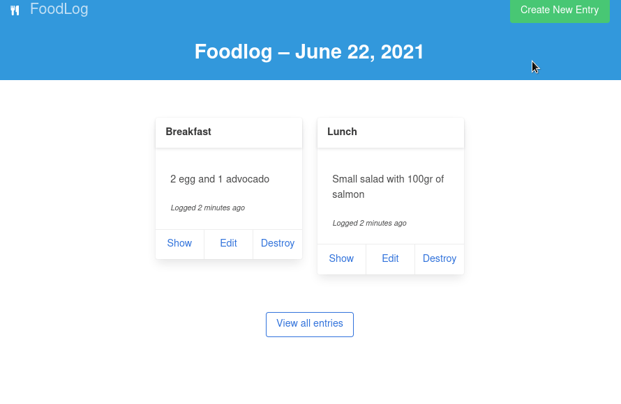

# Food Rating

Simple application using Ruby on Rails and Bulma as CSS template. The database is set for PostgreSQL. The current version allows you to create entries, edit and delete them. Also we can see all the entries per day, and see the calories count.

## To-Do:

- User profiles
- Improve the calendar

## Tools

- `VScode`
- Built on `Debian Linux`
- `ruby 2.6.7p197`
- `node v14.17.0`
- `rails 6.1.3.1`

## Demo

